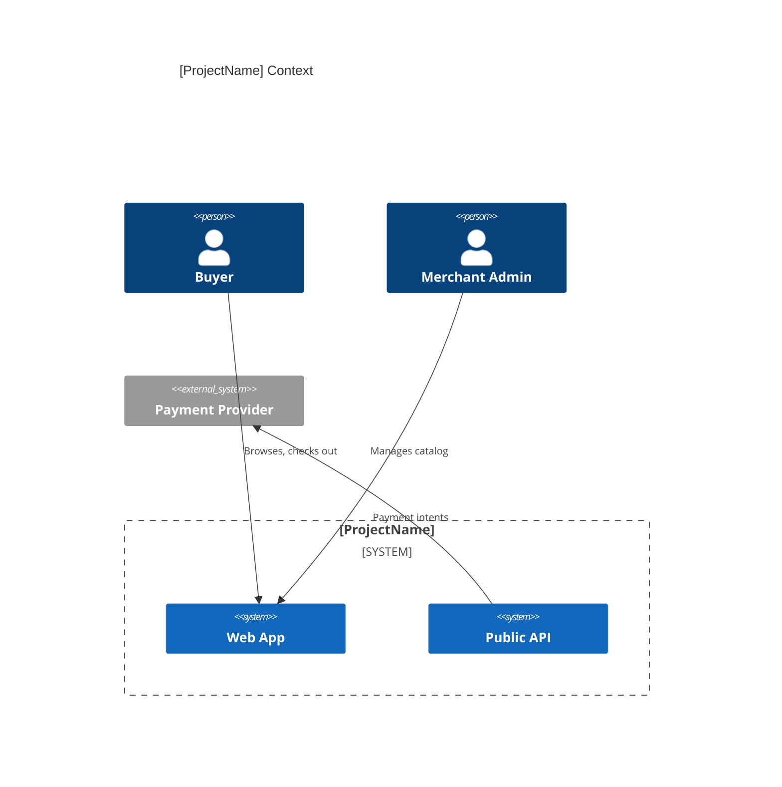
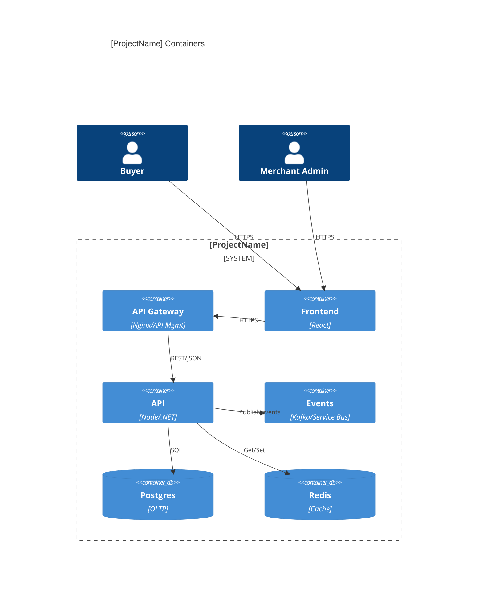

# Architecture Overview

Purpose: Capture the system mission, constraints, principles, and high-level structure. Includes C4 Context and Container diagrams.

## Hypothetical project anchor ([ProjectName])
- Mission: Multi-tenant commerce + payments + order tracking for web and public API channels.
- Regions: US/EU with tenant-aware data handling.
- Tenancy: tenantId on every request, claims, and partition keys.

## Abbreviation quick ref
- SLO: Service Level Objective
- RTO/RPO: Recovery Time/Point Objective
- RPS: Requests per second

## Scope and goals
- In-scope: catalog, cart/checkout, orders, payments, notifications, light reporting.
- Out-of-scope: in-store POS, ML recommendations (future).
- Success metrics: conversion uplift, payment success rate, SLO adherence.

## Principles
- Favor simplicity: start modular monolith; carve out services when contracts are stable.
- Security and privacy by default: least privilege, encrypt in transit/at rest, minimize PII.
- Observability first: traces/metrics/logs on critical paths; redaction by default.
- Deploy small, reversible changes: feature flags, blue/green, canary.
- Contract-first: versioned OpenAPI; backward-compatible changes first.

## Constraints
- Regulatory: PCI-adjacent (tokenized payments), GDPR residency for EU tenants.
- Technology: Cloud-first; Terraform for IaC; Postgres primary OLTP; Redis cache.
- Data: Partition by tenantId + time for orders; item size under 2 MB.

## Operational invariants
- All cross-tenant access is forbidden; enforce tenantId at gateway and service layers.
- All services must emit traces/metrics/logs with correlation IDs.
- Config is twelve-factor compliant; secrets never in images.

## Quality attributes and SLOs
- Availability: 99.9% monthly.
- Latency: p95 ≤ 300 ms, p99 ≤ 800 ms for key APIs; auth p95 ≤ 150 ms.
- Throughput: sustain 500–1,000 RPS before graceful degradation (queue/backpressure).
- RTO/RPO: 30–60m / 15m. Error budget: 0.1% monthly.

## C4 diagrams (Mermaid)
Context:

Container:

## Tech stack (example)
- Frontend: React + Vite; API client via OpenAPI-generated SDK; RUM for latency/errors.
- Backend: .NET/Node/Java; modular monolith initially, evolve to services by domain.
- Data: Postgres primary; Redis cache; object storage for receipts; metrics/logs/traces central.
- Messaging: Kafka/Service Bus for async flows (order lifecycle, notifications).

## Project-Specific Overrides
- Stack: Frontend React (buyer/admin), Blazor (internal ops if needed); Backend Node.js + .NET APIs; 
	Data: Postgres (orders/payments), MongoDB (catalog/content), SQL Server (reporting/legacy); 
	Cloud: Azure primary (App Service/AKS), AWS secondary (ECS/EKS for portability).
- SLOs: overall service 99.9% monthly; payments endpoints 99.95% monthly; auth p95 ≤ 150 ms; core API p95 ≤ 300 ms/p99 ≤ 800 ms; payments p95 ≤ 250 ms.
- Diagrams: choose Azure API Management or AWS API Gateway as gateway component based on deployment.
