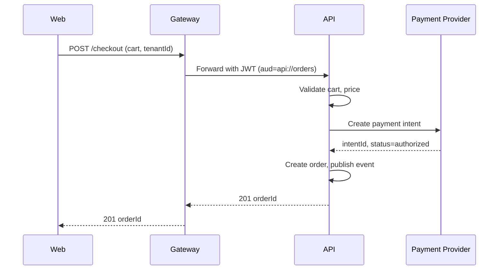
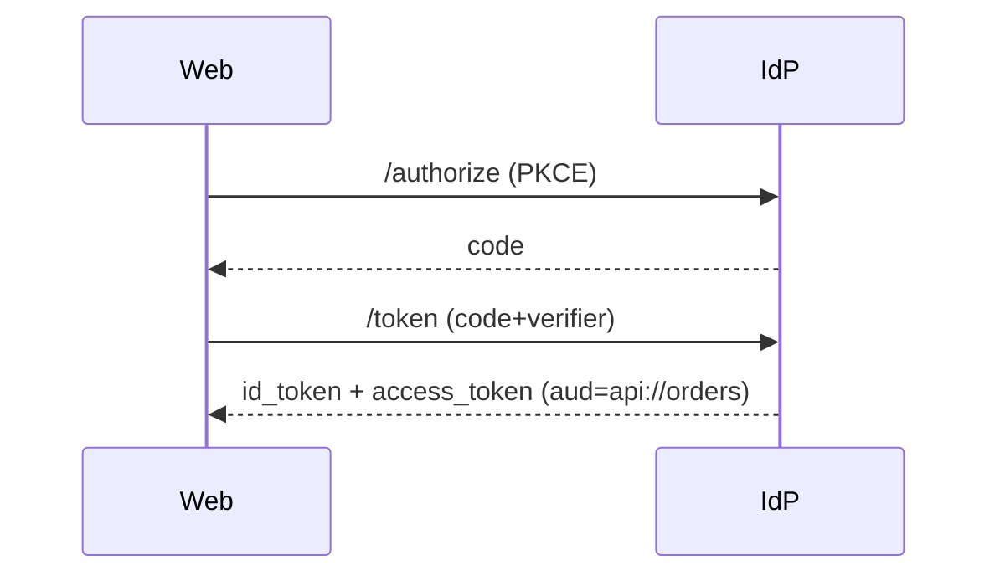

# Integration Views

Purpose: Show how the system interacts with external/internal services. Include C4 Container view excerpts and sequence diagrams for key flows.

## APIs and contracts
- REST/OpenAPI endpoints (versioned: /v1 first; backward compatible before breaking changes).
- Event schemas: versioned payloads with schema registry; additive changes preferred.
- Example (OpenAPI excerpt):
```yaml
/orders:
  get:
    summary: List orders
    parameters:
      - name: tenantId
        in: header
        required: true
        schema: { type: string }
    responses:
      "200": { description: OK }
```

## Gateway posture
- AuthN/Z: JWT (RS256), audience api://orders, scopes per domain (orders:read, orders:write).
- Rate limiting: 100 req/min/user default; burst allowed with leaky bucket.
- Transformations: header normalization (tenantId), error mapping to RFC 7807.
- Versioning: path-based (/v1), deprecation headers with sunset dates.

Abbreviations: AuthN (authentication), AuthZ (authorization), RFC 7807 (problem+json error format).

## Sequence diagrams (key flows)
Checkout (hypothetical):


Auth (OIDC):


## Error, retry, and idempotency
- Idempotency keys for POST (orders/payments).
- Retries with backoff and jitter; max attempts tuned per dependency.
- Circuit breakers for downstreams; fallbacks on read paths when possible.

## Testing expectations
- Contract tests for gateway → API and for event schemas.
- Load tests for hot endpoints (read and checkout) with tenant-aware data.

## Project-Specific Overrides
- Gateway: Azure API Management for Azure deployments; AWS API Gateway/ALB for AWS. JWT audience per cloud: api://orders (Azure) or arn-based (AWS) as needed.
- SDK generation: generate Node/.NET/TypeScript clients from OpenAPI for React/Blazor apps.
- Event bus: use Service Bus/Kafka on Azure; MSK/Kinesis on AWS; keep schema registry shared.
