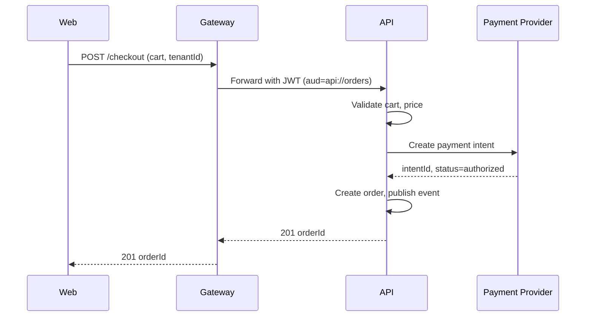
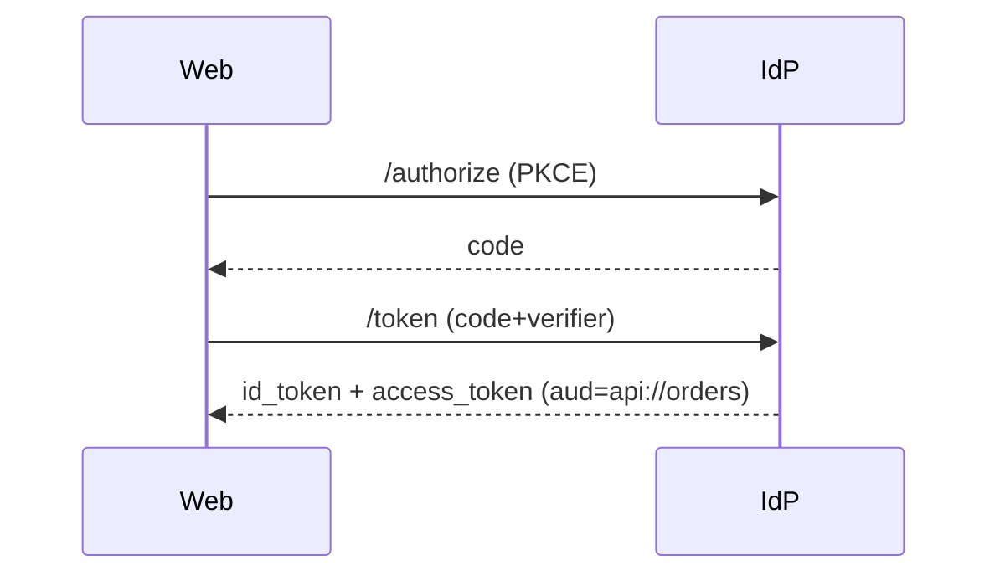

# Integration Views

This document shows how the system interacts with external and internal services, including C4 Container views and sequence diagrams for key workflows.

## API Contracts and Versioning

All APIs use REST with OpenAPI specifications. We use path-based versioning starting with `/v1`, and we're committed to backward compatibility before making any breaking changes. Event schemas are versioned with a schema registry, and we prefer additive changes that won't break existing consumers.

Here's an example of what an API specification looks like:
```yaml
/orders:
  get:
    summary: List orders
    parameters:
      - name: tenantId
        in: header
        required: true
        schema: { type: string }
    responses:
      "200": { description: OK }
```

## Gateway Responsibilities

The API gateway handles authentication and authorization, ensuring every request has a valid JWT token with the right audience and scopes. We use rate limiting with a default of 100 requests per minute per user, but allow short bursts via a leaky bucket algorithm. The gateway normalizes headers (adding `tenantId` as needed) and maps error responses to the RFC 7807 JSON problem format. All APIs are versioned at the path level (e.g., `/v1`), and we include deprecation and sunset headers when phasing out old versions.

## Key Workflows

Below are the most important integration flows: checkout (synchronous request) and authentication (OIDC flow).
Checkout (hypothetical):


Auth (OIDC):


## Reliability Patterns

To ensure reliability, we use idempotency keys on all POST requests that create resources like orders or payments. This prevents duplicate charges if a request is retried. We implement exponential backoff with jitter when calling external services, with maximum retry attempts tuned per dependency. Circuit breakers protect against cascading failures, and we implement fallbacks on read paths whenever possible.

## Test Strategy

We use contract tests to verify that the gateway correctly forwards requests to services and that event schemas remain compatible. Load tests focus on the hot paths (browsing and checkout) with realistic tenant-aware data to catch performance issues early.

## Project-Specific Overrides
- Gateway: Azure API Management for Azure deployments; AWS API Gateway/ALB for AWS. JWT audience per cloud: api://orders (Azure) or arn-based (AWS) as needed.
- SDK generation: generate Node/.NET/TypeScript clients from OpenAPI for React/Blazor apps.
- Event bus: use Service Bus/Kafka on Azure; MSK/Kinesis on AWS; keep schema registry shared.
