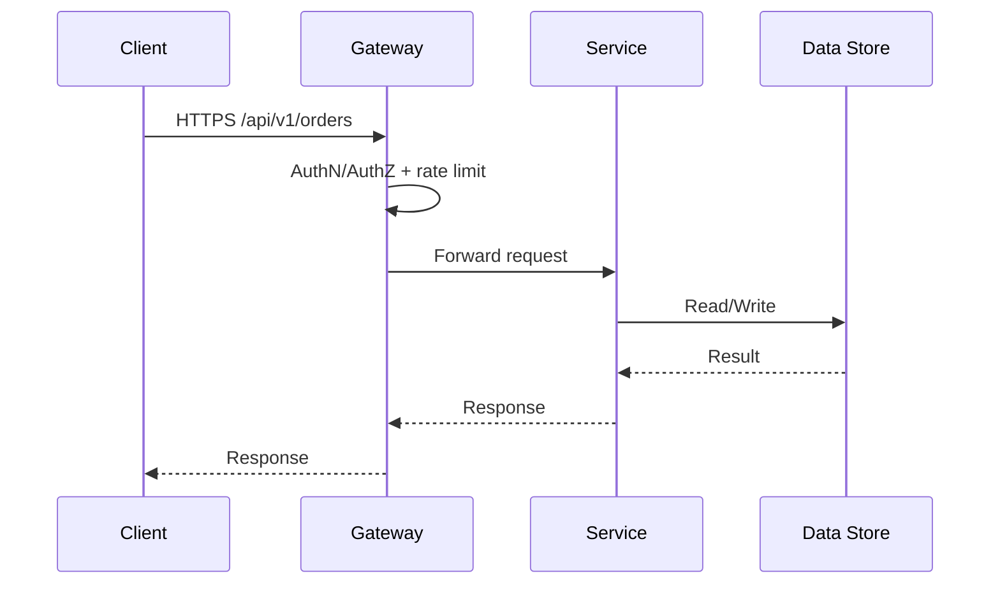

# API Gateway

Purpose: Standardize edge policies and contract governance.

Abbreviations: AuthN (authentication), AuthZ (authorization), JWT (JSON Web Token), SLA (Service Level Agreement).

## Core policies
- AuthN/Z: JWT validation, audience checks, scope enforcement.
- Rate limiting: per user/client/IP; e.g., 100 req/min default; higher for internal calls.
- Request/response transforms: header normalization (tenantId), error mapping to RFC 7807.
- Versioning: path-based (/v1) with deprecation/sunset headers.

## Resilience
- Timeouts tuned per upstream; retries with backoff for idempotent calls.
- Circuit breakers; bulkheads per route/cluster.
- Health checks and synthetic probes for key routes.

## Monitoring
- Per-route latency, error rate, saturation; alert on SLO breaches.

## Routing patterns
- Canary routes for new versions; weighted or header-based.
- Service discovery via registry or static configs.
- Webhooks: dedicated route class with stricter auth and rate limits.

## Diagrams
- Request path (Mermaid):


## Example policy snippet (conceptual)
```json
{
  "route": "/api/v1/orders",
  "auth": { "type": "jwt", "aud": "api://orders", "scopes": ["orders:read"] },
  "rateLimit": { "limit": 100, "window": "1m", "burst": 20 },
  "timeoutMs": 2000,
  "retry": { "attempts": 2, "backoffMs": 200 }
}
```

## Project-Specific Overrides
- Gateway choices: Azure API Management for Azure; API Gateway/ALB for AWS.
- Auth providers: Azure AD/Entra ID issuing JWTs; map scopes to routes (orders:read/write, payments:write).
- Route SLAs: Payment endpoints may need tighter latency/availability; tune rate limits per route and client type.
