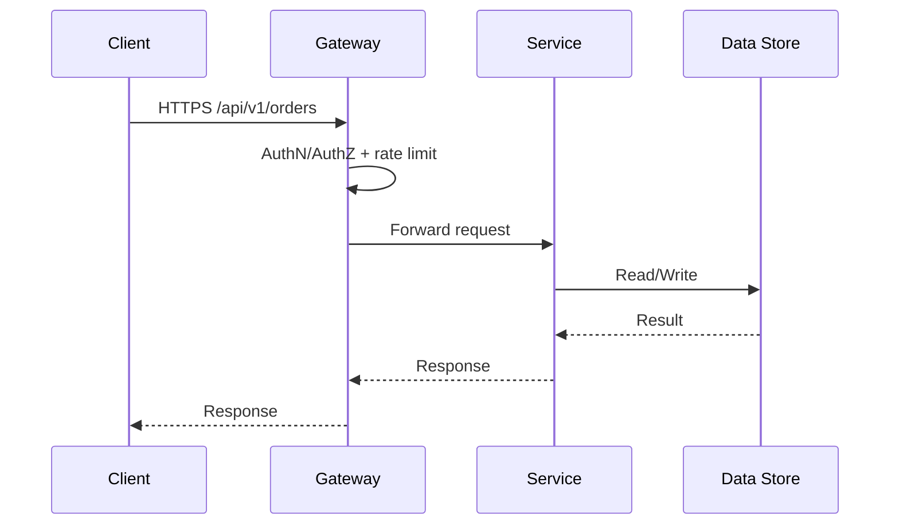

# API Gateway

The API gateway is your system's front door. It standardizes how requests are validated, transformed, and routed to backend services, and it's where we enforce consistent policies like authentication, rate limiting, and versioning.

## Core Responsibilities

The gateway validates JWT tokens and checks that the audience and scopes match the requested operation. It applies rate limiting (100 requests per minute by default, but higher for internal clients). It normalizes headers, adding `tenantId` and correlation IDs as needed. Error responses are mapped to the RFC 7807 JSON problem format for consistency. APIs are versioned at the path level (e.g., `/v1`), with deprecation and sunset headers when retiring old versions.

## Resilience

Set timeouts per upstream service—there's no one-size-fits-all timeout value. Retry idempotent calls with exponential backoff. Circuit breakers prevent cascading failures when a service is down. Bulkheads isolate failures by route or cluster. Health checks and synthetic probes on critical routes let you know when something breaks.

## Staying Visible

Monitor latency, error rate, and saturation for each route. Alert when service level objectives are breached so you can investigate and respond quickly.

## Routing and Deployments

Use canary routes to test new versions with a small subset of traffic before rolling out to everyone. Use header-based or weighted routing for fine-grained control. Service discovery can be static configs or a dynamic registry. Webhooks get a dedicated route class with stricter auth and rate limits since they often come from external systems.

## Diagrams
- Request path (Mermaid):


## Example policy snippet (conceptual)
```json
{
  "route": "/api/v1/orders",
  "auth": { "type": "jwt", "aud": "api://orders", "scopes": ["orders:read"] },
  "rateLimit": { "limit": 100, "window": "1m", "burst": 20 },
  "timeoutMs": 2000,
  "retry": { "attempts": 2, "backoffMs": 200 }
}
```

## Project-Specific Overrides
- Gateway choices: Azure API Management for Azure; API Gateway/ALB for AWS.
- Auth providers: Azure AD/Entra ID issuing JWTs; map scopes to routes (orders:read/write, payments:write).
- Route SLAs: Payment endpoints may need tighter latency/availability; tune rate limits per route and client type.
