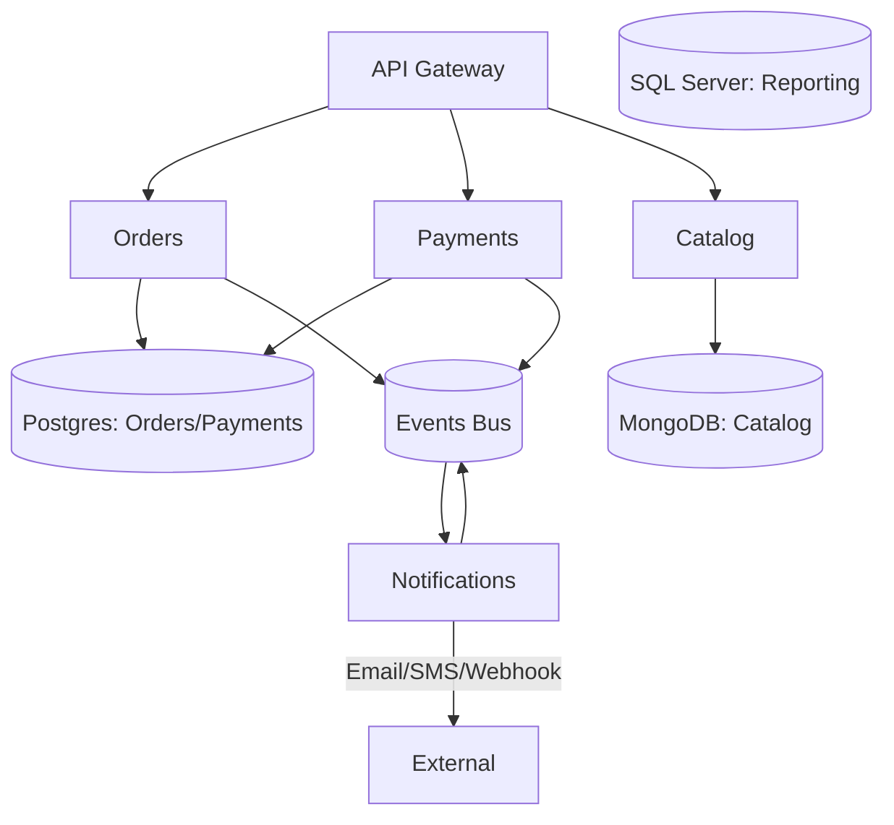
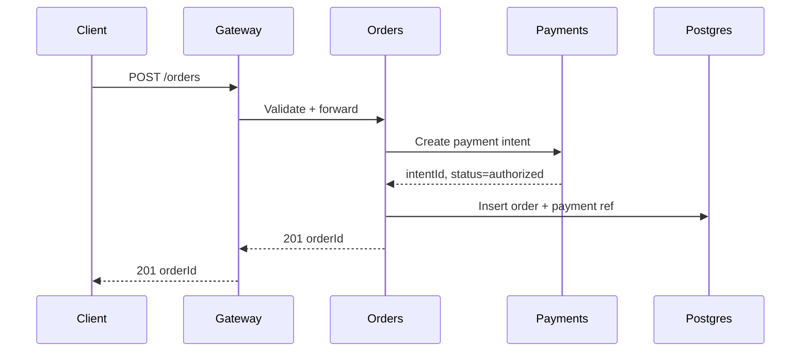

# Backend Architecture

Purpose: Define service boundaries, module layout, and runtime concerns.

## Deployment style
- Start with modular monolith unless clear distribution needs.
- Path to microservices by domain (e.g., Orders, Payments, Catalog) with stable contracts.

Abbreviations: SLA (Service Level Agreement), SLO (Service Level Objective), RPS (Requests per second).

## Module boundaries ([ProjectName] example)
- Orders: create/update/cancel, status transitions, emits OrderCreated/OrderPaid/OrderShipped.
- Payments: authorize/capture/refund with provider abstraction, idempotent operations.
- Catalog: products, pricing, availability; cache product details.
- Notifications: email/SMS/webhook fanout; retries with DLQ.
- Rules: no cross-module DB access; communicate via domain events or service APIs.

## Runtime concerns
- Validation at edges; input/output schemas versioned.
- Caching: Redis for read-heavy paths; cache busting on writes.
- Idempotency for POST/PUT of critical resources (orders, payments).
- Concurrency: optimistic locking on balances/orders; enforce invariants in DB.
- Backpressure: queue size alerts; shed load gracefully.

## Observability
- Tracing with OpenTelemetry; propagate trace IDs across services.
- Structured logging; metrics per endpoint (latency, error rate, RPS) and per event handler.
## Diagrams
- Logical modules (Mermaid):

- Request flow (sequence):

## Evolution to services
- Extract when: clear domain ownership, stable API, scaling/isolation need.
- Keep contract tests between gateway and services; consumer-driven contracts for events.

## Project-Specific Overrides
- Runtimes: Node.js and .NET for APIs; keep module boundaries consistent across runtimes.
- Data per domain: Orders/Payments → Postgres; Catalog → MongoDB; Reporting/legacy → SQL Server.
- Cross-cutting: enforce idempotency on payments/orders; shared telemetry via OpenTelemetry.
