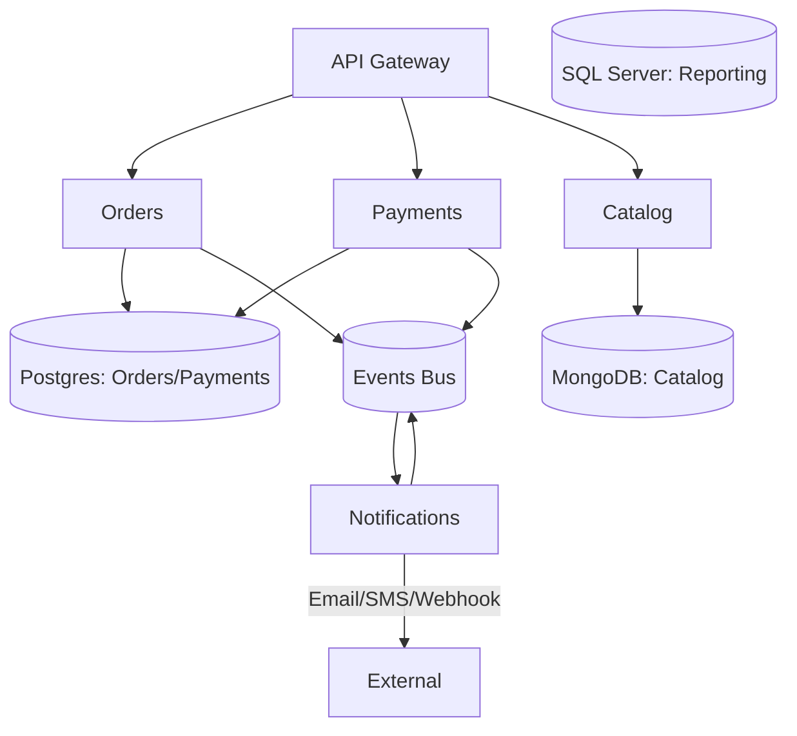
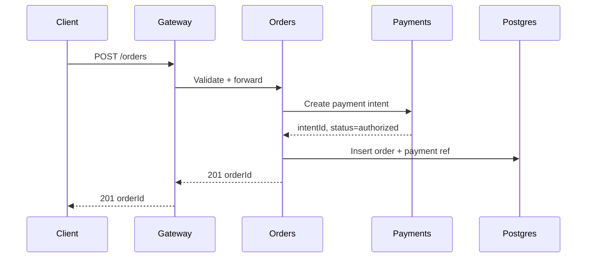

# Backend Architecture

This document defines service boundaries, module organization, and the runtime concerns you need to think about when building the backend.

## Starting Point: Modular Monolith

We recommend starting with a modular monolith unless you have a clear need to distribute services across different processes or machines. Only extract a service into its own deployment when you have stable contracts between modules and clear business reasons—such as independent scaling, team ownership, or isolation requirements.

## Module Structure

For our example commerce system, we organize the backend around these core domains:

- **Orders**: Creates, updates, and cancels orders. Manages status transitions. Publishes domain events (OrderCreated, OrderPaid, OrderShipped).
- **Payments**: Handles authorization, capture, and refunds with support for multiple payment providers. Operations are idempotent.
- **Catalog**: Manages products (SKUs), pricing, and availability. Data is cached heavily.
- **Notifications**: Fan-out email, SMS, and webhook notifications with retry logic and a dead-letter queue for failures.

All modules follow a key rule: no cross-module database access. Instead, modules communicate via domain events or synchronous service calls through well-defined APIs.

## What We Care About at Runtime

**Validation**: Validate input at the API boundary and output before returning responses. Version your schemas.

**Caching**: Redis handles read-heavy paths. When data changes, invalidate caches explicitly.

**Idempotency**: Critical operations like creating orders and processing payments must be idempotent. If the same request arrives twice, the result should be identical, not a duplicate charge.

**Concurrency**: Use optimistic locking when updating shared state (like balances or inventory). Let the database enforce invariants.

**Backpressure**: Monitor queue sizes and shed load gracefully when the system gets overwhelmed.

## Seeing What's Happening

Observability is not optional. Use OpenTelemetry to emit traces, and propagate trace IDs across service boundaries so you can follow a single request through the system. Log everything to a central place with structured output. Record metrics for every endpoint: latency, error rate, and requests per second. Do the same for event handlers.
## Diagrams
- Logical modules (Mermaid):

- Request flow (sequence):

## Growing to Microservices

As the system matures, you might extract a module into its own service. Wait until you have clear ownership (one team per service), a stable API contract, and a good reason to scale or isolate it. Always maintain contract tests between the gateway and services, and use consumer-driven contracts for event-based communication.

## Project-Specific Overrides
- Runtimes: Node.js and .NET for APIs; keep module boundaries consistent across runtimes.
- Data per domain: Orders/Payments → Postgres; Catalog → MongoDB; Reporting/legacy → SQL Server.
- Cross-cutting: enforce idempotency on payments/orders; shared telemetry via OpenTelemetry.
