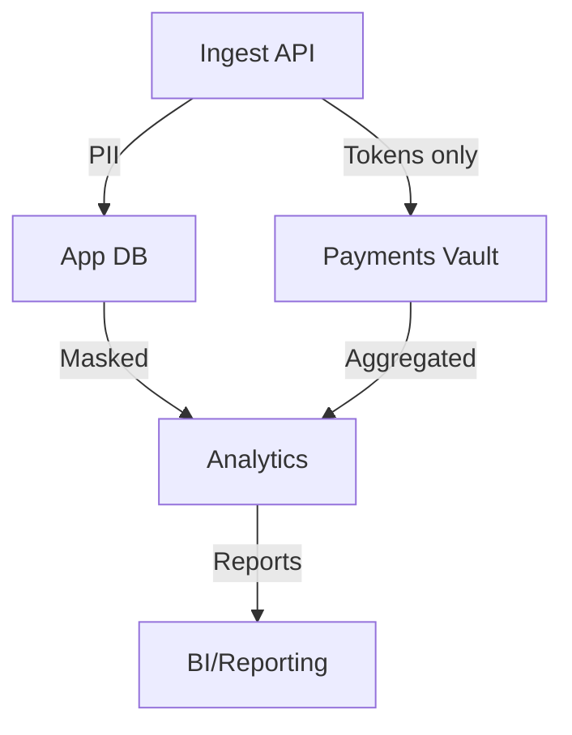

# Data Governance

Purpose: Define data classification, retention, and access controls.

Abbreviations: PII (Personally Identifiable Information), RBAC (Role-Based Access Control).

## Classification
- PII: direct identifiers (name, email, phone), sensitive tokens.
- Sensitive: payment tokens, auth tokens, secrets.
- Internal: operational data without PII.
- Public: none by default.

## Retention (examples)
- Orders/payments: 7 years (financial), unless regional laws differ.
- Logs: minimize PII; retain 30–90 days unless required for audits.
- Backups: match business/legal; encrypt; expire per policy.

## Access control
- Roles: admin (least used), app-readwrite, app-readonly, reporting-readonly.
- Grant via roles, not users; audit all access to PII.

## Masking and minimization
- Avoid storing raw PAN/CVV; store tokens only.
- Redact PII in logs, traces, analytics.
- Pseudonymize identifiers where possible in analytics.
## Diagrams
- Data classification flow (Mermaid):

## Example ([ProjectName])
- PII columns: user.email, user.phone, shipping_address.* → PII.
- Tokenized payments: store payment_token only; no PAN/CVV.
- Retention: orders/payments 7y; sessions 30d; events 90d hot, then archive.

## Project-Specific Overrides
- Residency: EU tenants stored in EU regions for Postgres/MongoDB/SQL Server.
- Masking: payment tokens only; mask PII in analytics and logs; strip PII from events where possible.
- Access: reporting roles read-only via SQL Server replicas; operational access audited.
