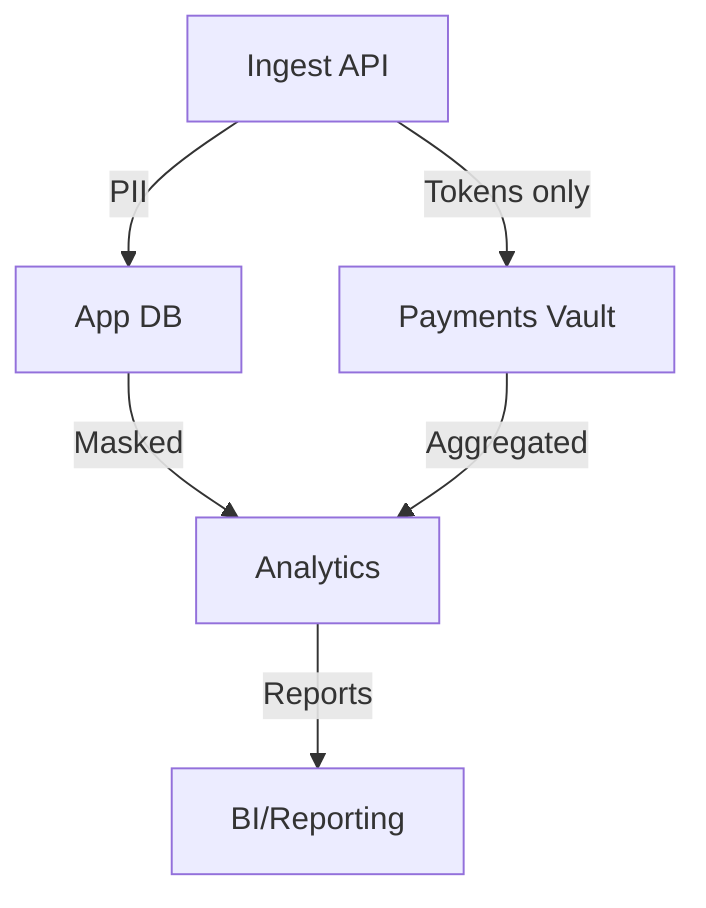

# Data Governance

This document defines how we classify data, how long we keep it, and who can access it.

**Note**: Data governance rigor scales with your tier and data sensitivity. See [Project-Tiers.md](../Project-Tiers.md) for tier-specific guidance.

## Data Classification

**PII (Personally Identifiable Information)**: Names, email addresses, phone numbers, and sensitive tokens that directly identify a person.

**Sensitive**: Payment tokens, authentication tokens, API keys, and other secrets that shouldn't be logged or exposed.

**Internal**: Operational data that doesn't contain PII, like order statuses or inventory counts.

**Public**: By default, we treat everything as internal or sensitive. Very few things are truly public.

## How Long We Keep Data

**Orders and payments**: Keep for 7 years (that's a financial/tax requirement), unless local laws specify otherwise.

**Logs**: Minimize PII in logs, and retain them for 30–90 days unless audits require longer retention.

**Backups**: Encrypt them and follow the same retention policies as the production data. Expire backups according to your policy to avoid indefinite storage costs.

## Who Can Access What

Create roles instead of granting permissions to individual users. Use something like: `admin` (sparingly), `app-readwrite` (for the app itself), `app-readonly` (read-only services), and `reporting-readonly` (for analytics). Audit all access to PII.

## Protecting Sensitive Data

Never store raw credit card numbers or CVV codes—always tokenize them. Strip PII from logs, traces, and analytics pipelines. When you do need to use real data for analytics, pseudonymize identifiers where possible.
## Diagrams
- Data classification flow (Mermaid):

## For the Commerce Example

PII columns include `user.email`, `user.phone`, and anything in `shipping_address`. Store only payment tokens, never raw card data. Keep orders and payments for 7 years, sessions for 30 days, and hot event data for 90 days before archiving.

## Project-Specific Overrides
- Residency: EU tenants stored in EU regions for Postgres/MongoDB/SQL Server.
- Masking: payment tokens only; mask PII in analytics and logs; strip PII from events where possible.
- Access: reporting roles read-only via SQL Server replicas; operational access audited.
