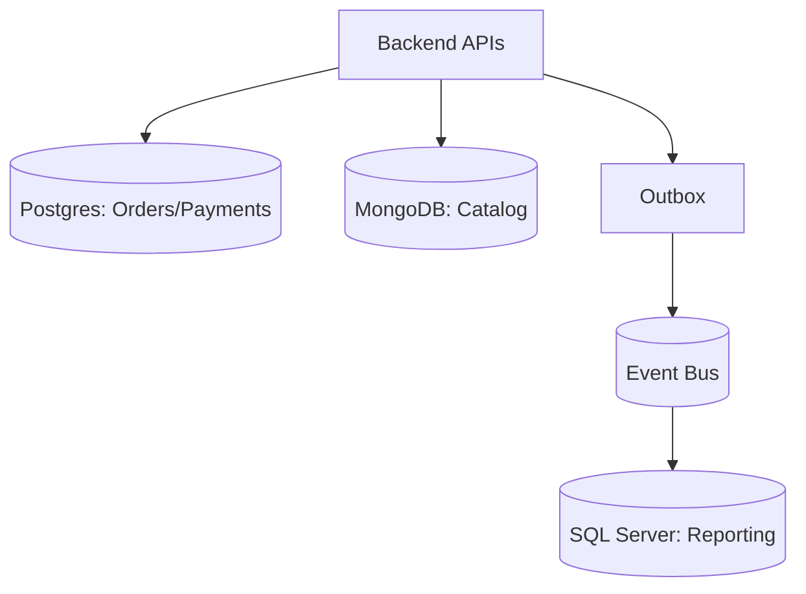

# Database Design

This document captures your database choices, data modeling approach, and resilience strategy.

**Note**: Database complexity and redundancy depend on your tier. See [Project-Tiers.md](../Project-Tiers.md) for tier-specific guidance.

## Choosing the Right Database

Different parts of your system may have different database needs. A relational database like Postgres handles transactional workloads well. NoSQL databases like Cosmos DB or DynamoDB excel when you need high-scale key-value or document storage. Redis provides fast caching. For analytics, a columnar database or data warehouse is better suited.

## Data Modeling

Normalize tables to avoid anomalies and keep storage compact. However, denormalize specific read paths if performance becomes an issue—just be prepared to manage cache invalidation or use materialized views. When choosing partition or shard keys, pick high-cardinality values like `tenantId`, `userId`, or `orderId` combined with a timestamp. Avoid keys with low cardinality like `status` or `country`, which create hot partitions.

## The Commerce Example

For our example system:

- **Orders table**: Primary key is `order_id`, partitioned by `tenant_id` and month. Includes status, total amount, and currency.
- **Payments table**: Primary key is `payment_id` with a foreign key to `order_id`. Stores the provider's transaction status and tokenized payment method (never raw card data).
- **Catalog**: Products are stored with SKU, price, and stock levels. A separate price history table tracks pricing changes for auditing.
- **Events outbox**: Stores domain events waiting to be published. This pattern ensures events are published even if the message broker is temporarily down.

## Database Changes

Migrations live in version control and are forward-only—never write a migration that destroys data without a good reason. The safest approach is to deploy new code that tolerates both the old and new schema, then run the migration, then flip the feature flag if needed. Use migration tags to track which environment each migration has run in, and implement schema drift detection to catch surprises.

## High Availability and Disaster Recovery

Back up your databases every day with full backups, plus point-in-time recovery capability. Test restores every quarter to make sure they actually work—don't discover on disaster day that your backups are corrupted. Set up read replicas so you can scale reads without hitting the primary. Test failover regularly.

## Keeping Data Safe

Encrypt data both in transit (TLS) and at rest (KMS-managed keys). Create database users with the least privilege needed for their role. Rotate credentials regularly.

## Diagrams
- Logical data flow (Mermaid):

## Project-Specific Overrides
- Engine picks: Orders/Payments on Postgres (cloud-managed); Catalog on MongoDB Atlas; Reporting/legacy data on SQL Server.
- Partition keys: tenant_id + order_month for orders; tenant_id for payments; tenant_id for catalog collections.
- Retention: orders/payments 7y; events 90d hot then archive; sessions 30d.
