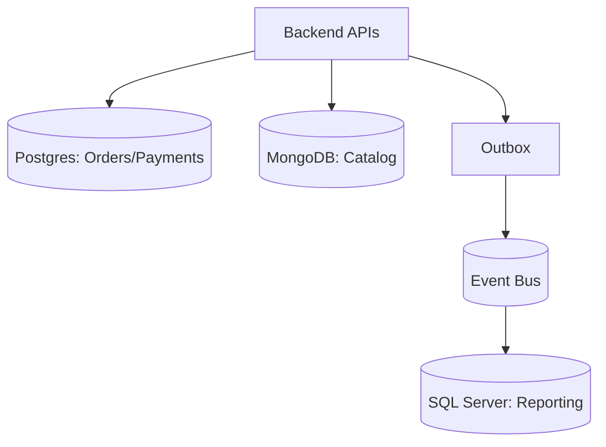

# Database Design

Purpose: Capture data store choices, modeling, and resilience.

Abbreviations: OLTP (Online Transaction Processing), PITR (Point-in-Time Recovery), PK (Primary Key), FK (Foreign Key).

## Engines and roles (example)
- OLTP: Postgres/SQL Server.
- NoSQL: Cosmos DB/Dynamo for high-scale key-value or document needs.
- Caching: Redis for hot paths.
- Analytics: columnar or lakehouse downstream.

## Modeling
- Normalize for consistency; denormalize for read-heavy paths as needed.
- Partitioning/sharding: choose high-cardinality keys (e.g., tenantId, userId, orderId+time).
- Soft deletes vs hard deletes: define policy; track audit fields.

## Example ([ProjectName])
- Orders table: PK (order_id), partition key (tenant_id, order_month), status, total, currency.
- Payments table: PK (payment_id), FK order_id, provider_status, tokenized method.
- Catalog: product table with SKU, price, stock; price history table for audits.
- Events outbox: stores domain events for reliable publish.

## Migrations
- Versioned migrations in repo; forward-only; blue/green safe changes first.
- Rollout order: deploy code that tolerates new schema → migrate → flip features.
- Use migration tags by environment and schema drift checks.

## Resilience
- Backups: daily full + PITR; test restores quarterly.
- Replication: read replicas for reads; failover tested.
- RPO/RTO alignment: 15m/30–60m defaults.

## Security
- Encrypt at rest; TLS in transit.
- Least-privilege DB roles; rotate credentials.

## Diagrams
- Logical data flow (Mermaid):

## Project-Specific Overrides
- Engine picks: Orders/Payments on Postgres (cloud-managed); Catalog on MongoDB Atlas; Reporting/legacy data on SQL Server.
- Partition keys: tenant_id + order_month for orders; tenant_id for payments; tenant_id for catalog collections.
- Retention: orders/payments 7y; events 90d hot then archive; sessions 30d.
