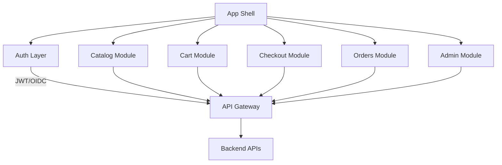
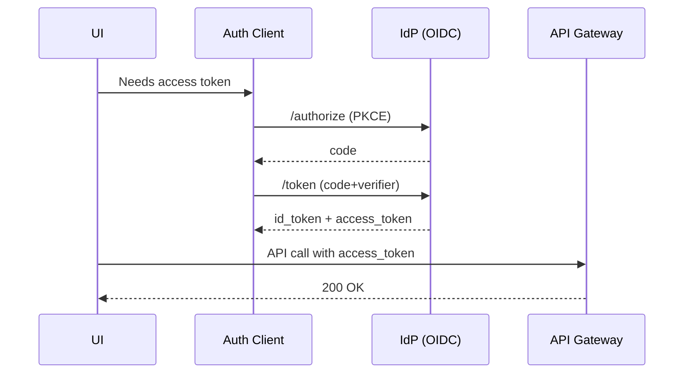

# Frontend Architecture

Purpose: Define app composition, performance, and integration patterns.

## Structure ([ProjectName] example)
- App shell + feature modules (Catalog, Cart, Checkout, Orders, Admin).
- Code splitting per route and per role (buyer/admin); lazy load heavy admin screens.
- State management: React Query for server cache; local state for UI; optional Redux for shared app state.
- Routing: authenticated/unauthenticated guards; 404/500 fallbacks; tenant-aware routes.

Abbreviations: TTI (Time to Interactive), CLS (Cumulative Layout Shift), RUM (Real User Monitoring).

## API access
- Generated clients from OpenAPI; centralized HTTP client with retry/backoff and request ID propagation.
- Auth: bearer tokens; silent refresh; CSRF protection if cookies used.
- Error handling: normalize errors to RFC 7807 shape.

## Performance budgets (examples)
- Bundle: ≤ 200KB gzipped per primary route.
- P95 TTI: ≤ 2.5s on mid-tier devices; CLS within Core Web Vitals.
- Images: lazy load; compress; use CDN.

## Accessibility and UX
- WCAG 2.1 AA; keyboard navigation; focus management.
- Error states: actionable messages; retry affordances; optimistic UI for cart.

## Observability
- Frontend logging with redaction; RUM metrics for latency and errors.
- Trace context propagation via headers when calling APIs.

## Diagrams
- Component/layout (Mermaid):

- Auth/token refresh (sequence):

## Project-Specific Overrides
- Frameworks: React for buyer/admin apps; Blazor for internal ops portal.
- API clients: generate TypeScript/.NET clients from OpenAPI; share types where possible.
- Performance: keep bundle budgets ≤ 200KB gzipped/route; monitor via RUM; enforce lint/format in CI.
