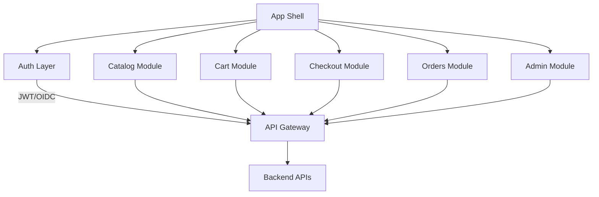
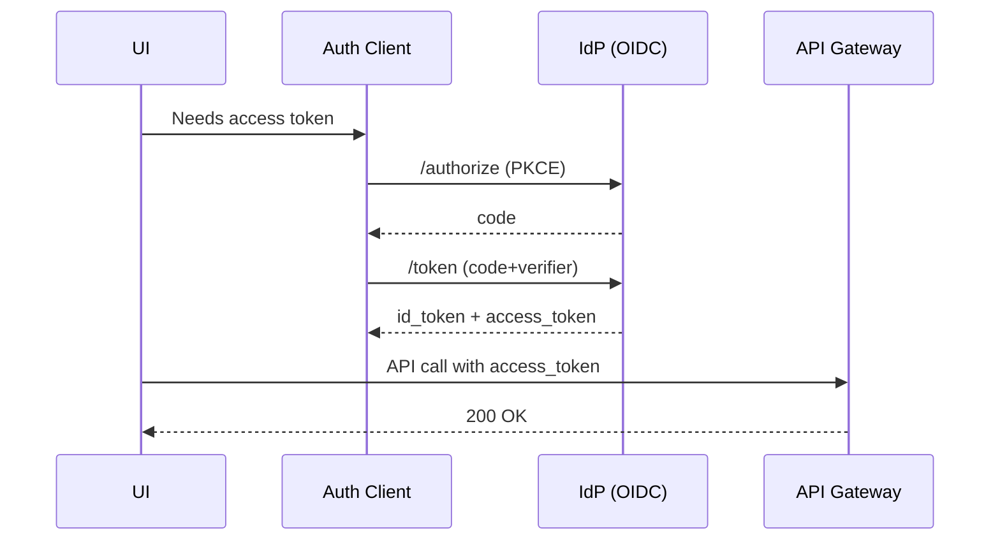

# Frontend Architecture

This document defines how you organize the frontend application, performance targets, and how it integrates with backend services.

## Application Structure

We recommend an app shell architecture with feature modules for each domain: Catalog, Cart, Checkout, Orders, and Admin. Load code per route and per role so a buyer never downloads code for admin features. For state management, use React Query to cache server state, local state for UI interactions, and Redux only if you truly need shared state across many parts of the app. Use authenticated/unauthenticated route guards and show proper 404 and 500 pages. Keep routes tenant-aware.

## Talking to the Backend

Generate TypeScript clients from your OpenAPI specs so you get type safety. Use a centralized HTTP client that handles retries and backoff automatically. Include request IDs in headers for tracing. Include bearer tokens in the Authorization header and refresh them silently when they expire. Implement CSRF protection if you're using cookies. Normalize error responses to the RFC 7807 JSON problem format so error handling is consistent throughout the app.

## Performance Budgets

Set a target of 200 KB gzipped per primary route. Aim for Time to Interactive within 2.5 seconds on a mid-tier mobile device. Keep Cumulative Layout Shift within Core Web Vitals thresholds. Lazy load images, compress them, and serve them through a CDN.

## Accessibility and User Experience

Meet WCAG 2.1 AA standards. Make sure the app is fully navigable with the keyboard, and manage focus properly. Show error messages that explain what went wrong and how to fix it. Use optimistic updates in the cart so it feels snappy.

## Observability

Log from the frontend, but use redaction to remove sensitive data. Use Real User Monitoring to track actual latency and errors in production. Propagate trace context via headers when calling APIs so you can correlate frontend and backend logs.

## Diagrams
- Component/layout (Mermaid):

- Auth/token refresh (sequence):

## Project-Specific Overrides
- Frameworks: React for buyer/admin apps; Blazor for internal ops portal.
- API clients: generate TypeScript/.NET clients from OpenAPI; share types where possible.
- Performance: keep bundle budgets ≤ 200KB gzipped/route; monitor via RUM; enforce lint/format in CI.
