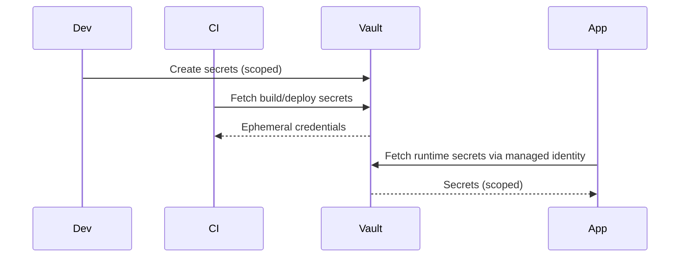

# Secrets Management

Purpose: Standardize how secrets are stored, rotated, and consumed.

## Defaults
- Store secrets in vault/key vault/parameter store; never in git.
- Rotation: at least every 90 days or on personnel change.
- Access: least privilege via managed identities/service principals.
- Local dev: .env.local only; never commit. Provide sample .env.example without values.

Abbreviations: KV (Key Vault), SP (Service Principal), CI (Continuous Integration).

## Handling
- Inject via environment variables or secret mounts; avoid baking into images.
- Prefer short-lived credentials (federated identity) over long-lived static keys.
- Protect backups and logs from leaking secrets; redact by default.

## Diagram

## Example (hypothetical [ProjectName])
- Vault: Azure Key Vault (prod/stage), local .env.local with dummy tokens.
- CI secrets: GitHub Actions env-scoped secrets; least-privilege service principal for Terraform plan/apply.
- App secrets: DB URL, PSP tokens, JWT signing keys in vault; apps use managed identity to fetch.

## Audit
- Track secret creation/rotation/usage events.
- Alert on anomalies (access from new locations, excessive failures).

## Checklist
- [ ] No secrets in repo history.
- [ ] Sample env files contain placeholders only.
- [ ] CI has separate scoped secrets per environment.
- [ ] Rotation policy documented and tested.

## Project-Specific Overrides
- Vault choice: Azure Key Vault for Azure footprints; AWS Secrets Manager/SSM Parameter Store for AWS.
- Rotation: 90 days default; 30 days for payment provider keys; rotate DB creds on role changes.
- Local dev: use .env.local with sample tokens; fetch ephemeral creds via dev vault where possible.
