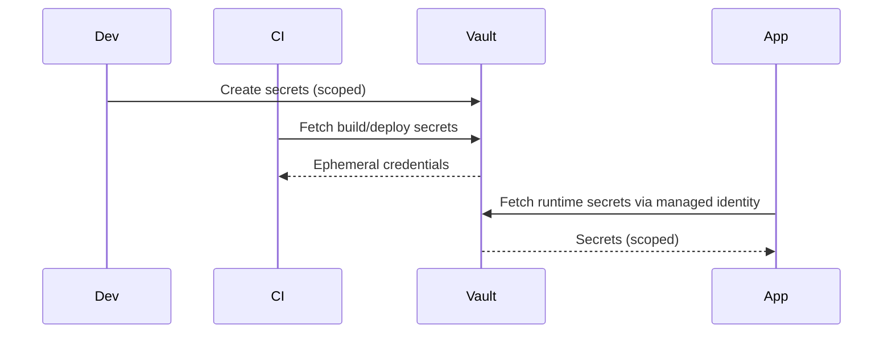

# Secrets Management

This document standardizes how secrets are stored, accessed, and rotated throughout the system.

**Note**: Secret management complexity increases with your tier. See [Project-Tiers.md](../Project-Tiers.md) for tier-specific guidance.

## The Rules

Never store secrets in git. Always use a vault or key management service like Azure Key Vault, AWS Secrets Manager, or similar. Rotate secrets at least every 90 days, or immediately when someone leaves the team. Use managed identities or service principals instead of long-lived API keys and passwords. For local development, use `.env.local` files that are gitignored, and never commit actual credentials.

## Getting Secrets Into Your Application

Pass secrets as environment variables or mount them as files. Don't bake them into container images. Short-lived credentials (like tokens generated from federated identity) are much better than static keys that last forever. When secrets end up in logs or backups, make sure they're redacted.

## Diagram

## For the Commerce Example

Use Azure Key Vault for production and staging. In local development, use `.env.local` with dummy placeholder tokens. CI/CD pipelines use scoped service principals with just enough permission to build and deploy. The application uses managed identity to fetch database URLs, payment provider tokens, and JWT signing keys from the vault.

## Keeping an Eye on Things

Track when secrets are created, rotated, and accessed. Set up alerts if you see access from unusual locations or repeated failed attempts to retrieve a secret.

## Checklist
- [ ] No secrets in repo history.
- [ ] Sample env files contain placeholders only.
- [ ] CI has separate scoped secrets per environment.
- [ ] Rotation policy documented and tested.

## Project-Specific Overrides
- Vault choice: Azure Key Vault for Azure footprints; AWS Secrets Manager/SSM Parameter Store for AWS.
- Rotation: 90 days default; 30 days for payment provider keys; rotate DB creds on role changes.
- Local dev: use .env.local with sample tokens; fetch ephemeral creds via dev vault where possible.
