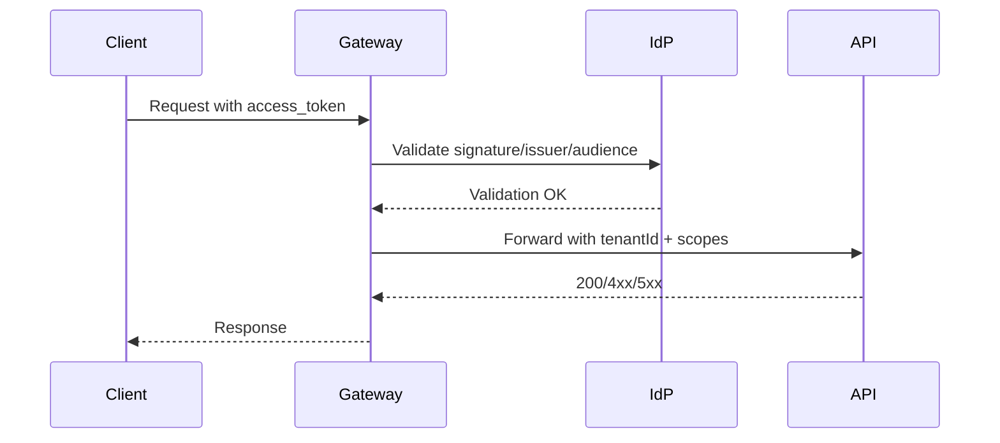

# Security Model

This document outlines how we handle identity, access control, data protection, and security assurance across the system.

**Note**: Security rigor scales with your project tier and data sensitivity. See [Project-Tiers.md](../Project-Tiers.md) for tier-specific guidance.

## Who Gets Access?

We use OpenID Connect (OIDC) and OAuth 2.0 for authentication. Tokens are JWT tokens signed with RS256. Access tokens expire after 15 minutes; refresh tokens last 24 hours. Client applications on the web use the PKCE flow to secure the authorization code, preventing token theft.

For least-privilege access, we grant scopes per domain (e.g., `orders:read`, `payments:write`). Service-to-service communication uses client credentials flow. For sensitive operations, multi-factor authentication is required on admin and break-glass accounts, and we use conditional access policies to require extra verification for privileged roles.

## Authorization

The API gateway enforces coarse-grained access control by checking scopes on the JWT. Services then enforce fine-grained authorization based on their domain rules (ABAC/RBAC).

Tenant isolation is critical. The `tenantId` appears in every JWT claim and must be verified on every request at both the gateway and service layers. A sample claim mapping looks like: `sub` (user ID), `tid` (tenant ID), `scope` (list of scopes), and `role` (optional).

## Protecting Data

**In transit**: TLS 1.2 or newer with modern cipher suites. HSTS headers on all public endpoints to prevent downgrade attacks.

**At rest**: Encryption keys are managed by the cloud provider's KMS. Enable encryption for databases, queues, and object storage.

**Handling PII**: Minimize collection and storage. Never log secrets or personally identifiable information. Tokenize payment card data. Refer to the Glossary and Data Governance documents for how to classify and handle sensitive data.

## Secrets and Cryptographic Keys

Store all secrets in a vault or key management system—never commit them to the repository. Rotate secrets at least every 90 days. For workloads running in the cloud, use managed identities or service principals instead of static API keys or credentials.

## Audit Trail and Logging

Create a centralized audit log for admin actions and security-sensitive operations. Make the audit trail immutable or write-once, with retention aligned to your compliance requirements. Correlate audit entries with trace IDs so you can connect the dots during investigations.

## Testing and Security Gates

Run static application security testing (SAST) and dynamic security testing (DAST) as part of continuous integration. Scan dependencies and container images for known vulnerabilities. Conduct threat modeling for major features and review new integrations with external systems or data stores.

**Tier-Specific Security:**
- **POC**: Security is optional; focus on speed
- **MVP**: Basic SAST, dependency scanning, manual security review pre-launch
- **Full Build**: SAST/DAST in pipeline, threat modeling, penetration testing before major releases
- **Enterprise**: Continuous security scanning, formal security audits, compliance certifications, incident response plan

## Diagrams
- AuthN/AuthZ flow (Mermaid):

## Project-Specific Overrides
- IdP: use Azure AD / Entra ID for primary; allow OIDC-compatible for AWS deployments. JWT audience per API (orders/payments/catalog).
- Key storage: Azure Key Vault (Azure), AWS KMS/Secrets Manager (AWS). Keep signing keys per environment.
- Geo/data residency: pin EU tenants to EU data stores; ensure gateway enforces tenant-region affinity.
