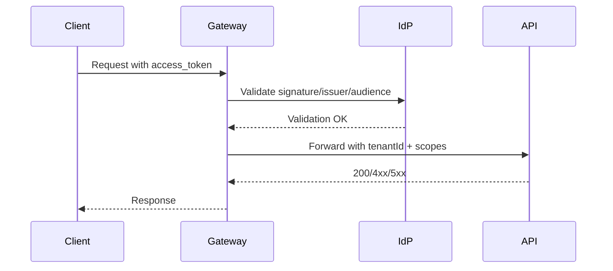

# Security Model

Purpose: Define identity, authZ, data protection, and assurance controls.

## Identity and access
- IdP: OIDC/OAuth2; tokens JWT RS256; access 15m, refresh 24h; PKCE for public clients.
- Scopes/roles: least privilege; service-to-service via client credentials.
- MFA: required for admin and break-glass accounts; conditional access for privileged roles.

Abbreviations: IdP (Identity Provider), MFA (Multi-Factor Authentication), PKCE (Proof Key for Code Exchange).

## AuthZ patterns
- API gateway enforces authentication and coarse scopes.
- Services enforce fine-grained authZ (ABAC/RBAC) per domain.
- Tenant isolation: tenantId in tokens and partition keys; verify on every request.
- Sample claim mapping: `sub` userId, `tid` tenantId, `scope` list, `role` optional.

## Data protection
- In transit: TLS 1.2+ with modern ciphers; HSTS on public endpoints.
- At rest: KMS-managed keys; enable encryption for databases, queues, object storage.
- PII handling: minimize, tokenize payment data; avoid logging secrets/PII; use data classification from Glossary/Data Governance.

Abbreviations: TLS (Transport Layer Security), KMS (Key Management Service), PII (Personally Identifiable Information).

## Secrets and keys
- Store in vault/KV; never commit. Rotate at least every 90 days.
- Use managed identities/service principals for workloads; avoid static keys.

## Audit and logging
- Centralized audit log for admin and security-sensitive actions.
- Immutable or write-once retention for audit trails.
- Correlate with trace IDs; retain per compliance needs.

## Testing and gating
- SAST/DAST in CI; dependency scanning; container scanning.
- Threat modeling per major feature; review external integrations and new data stores.

Abbreviations: SAST (Static Application Security Testing), DAST (Dynamic Application Security Testing).

## Diagrams
- AuthN/AuthZ flow (Mermaid):

## Project-Specific Overrides
- IdP: use Azure AD / Entra ID for primary; allow OIDC-compatible for AWS deployments. JWT audience per API (orders/payments/catalog).
- Key storage: Azure Key Vault (Azure), AWS KMS/Secrets Manager (AWS). Keep signing keys per environment.
- Geo/data residency: pin EU tenants to EU data stores; ensure gateway enforces tenant-region affinity.
